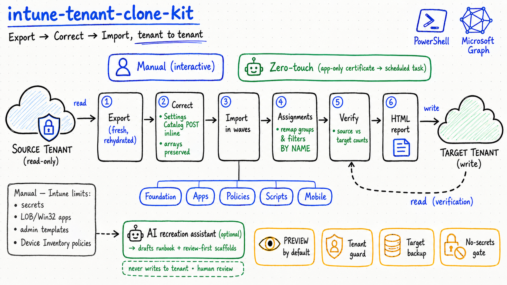

> [🇫🇷 Version française](../fr/README.md)

# intune-tenant-clone-kit

   

**Reliably clone a Microsoft Intune configuration from one tenant to another (SOURCE → TARGET).**



This kit fixes the classic pitfalls of cross-tenant Intune duplication: serialization corruption of
polymorphic payloads (Settings Catalog), atomic policy creation, missing compliance actions, script
content not returned by the export, and identifiers that are not portable between tenants.

> ⚠️ **Read [`DISCLAIMER.md`](DISCLAIMER.md) before any use.** Provided "as is", without warranty.
> Always test on a sandbox tenant first. You are responsible for its use on your tenants.

---

## What the kit does

Full **export → correct → import** cycle.

**Two execution modes:**
- **Manual, step by step** — [`EXECUTER.md`](EXECUTER.md): interactive sign-in, every write in PREVIEW first.
- **Zero-touch, unattended** — [`EXECUTER_AUTO.md`](EXECUTER_AUTO.md): a single command
  (`Invoke-IntuneCloneKit-Unattended.ps1`), **app-only certificate** authentication, no prompt,
  export → cleanup → import → assignments → verification → HTML report. Ideal as a scheduled task.

- **Fresh export** of the source tenant (PowerShell 7 + Microsoft Graph SDK, `beta` endpoint), **already
  rehydrated**: Settings Catalog settings, base64 content of scripts/remediations, compliance actions
  (`scheduledActionsForRule`), notification messages.
- **Corrected import**: single POST with `settings` **inline** (Settings Catalog), strict preservation
  of `[]` / single-element arrays, injection of `scheduledActionsForRule`, name-based idempotence,
  CSV log, **PREVIEW by default**.
- Optional **cleanup** of a previous failed import, **group/assignment remap by name**, anti-overwrite
  guardrail (refuses to write if the current context is not the target tenant).

## Coverage

| ✅ Automated | ⏸️ Manual (Intune limits) |
|---|---|
| Settings Catalog, configuration profiles, compliance, scripts, remediations, filters, scope tags, Store apps, app config, app protection, Autopilot, notifications, groups + assignments, Windows Update (rings + Feature/Quality/Driver profiles), Terms & Conditions, Device categories, custom RBAC roles | Secrets (Wi-Fi/PSK, AppLocker/WDAC, encrypted OMA), LOB/Win32/VPP apps (binaries), Admin Templates, Endpoint Security (intents), Enrollment, **Device Inventory policies** |

> 📌 Full list of what is **not** cloned (and how to handle each item): [`LIMITATIONS.md`](LIMITATIONS.md).

## Prerequisites

- **PowerShell 7.4+** (required — not Windows PowerShell 5.1).
- The `Microsoft.Graph.Authentication` module.
- An administrator account on **each** tenant (read on the source, write on the target), with admin
  consent for the `DeviceManagement*.ReadWrite.All` scopes.

## Quick start

```powershell
# 1) Configure
Copy-Item config.example.ps1 config.ps1
#    -> edit config.ps1: fill in SourceTenantId / TargetTenantId / domains

# 2) Follow EXECUTER.md (manual) or EXECUTER_AUTO.md (zero-touch)
```

Details, root causes and troubleshooting: [`docs/METHODOLOGY.md`](docs/METHODOLOGY.md) · [`docs/TROUBLESHOOTING.md`](docs/TROUBLESHOOTING.md) · [`docs/SEQUENCE.md`](docs/SEQUENCE.md) (execution sequence).

## AI assist (optional, experimental)

For the items the kit cannot auto-import (see [`LIMITATIONS.md`](LIMITATIONS.md)),
[`scripts/Invoke-IntuneAIAssist.ps1`](scripts/Invoke-IntuneAIAssist.ps1) can ask a **configurable AI
endpoint** (Azure OpenAI / OpenAI / custom) to draft a recreation **runbook + PowerShell scaffolds**
for human review. It **never writes to a tenant**, redacts secrets before sending, and is **opt-in** —
the API key is yours (set in `config.ps1`, git-ignored) and is never shipped with the kit.

## Advanced helpers (optional)

- **`scripts/Recover-IntuneOmaSecrets.ps1`** — pull encrypted OMA-URI secret values from the source and
  re-inject them into the export (also the orchestrator's `-RecoverSecrets`), so those profiles import
  automatically. Needs source read rights; writes plaintext to disk — protect it.
- **`scripts/Publish-IntuneApp.ps1`** *(experimental)* — orchestrate a Win32 `.intunewin` upload from a
  local binary + metadata (create app → content version → SAS → block upload → commit).
- **`scripts/Invoke-IntunePortalCaptureToScript.ps1`** — turn a portal capture (Device Inventory, gated
  endpoints) into an AI-drafted, review-first recreation script.

## Structure

```
en/
├── README.md
├── EXECUTER.md                         # manual mode: step -> command
├── EXECUTER_AUTO.md                    # zero-touch mode: a single command
├── DISCLAIMER.md
├── Invoke-IntuneCloneKit-Unattended.ps1 # unattended orchestrator (app-only certificate)
├── config.example.ps1                  # copy to config.ps1 (gitignored)
├── EN.png                              # architecture diagram
├── scripts/                            # corrected import engine, exporter, cleanup, remap, assignments
├── docs/                               # methodology + troubleshooting
├── sample/                             # SYNTHETIC mini-export (expected structure)
└── tools/                              # New-IntuneCloneKitAppRegistration.ps1, check-no-secrets.ps1
```

## Security & data

This bundle **contains no real tenant data**. Real data produced at runtime (`input/`, `output/`,
`logs/`, `backup_*`, `config.ps1`) is **git-ignored**. The [`tools/check-no-secrets.ps1`](tools/check-no-secrets.ps1)
script checks for the absence of sensitive identifiers before publishing.

## License

[MIT](../LICENSE).
