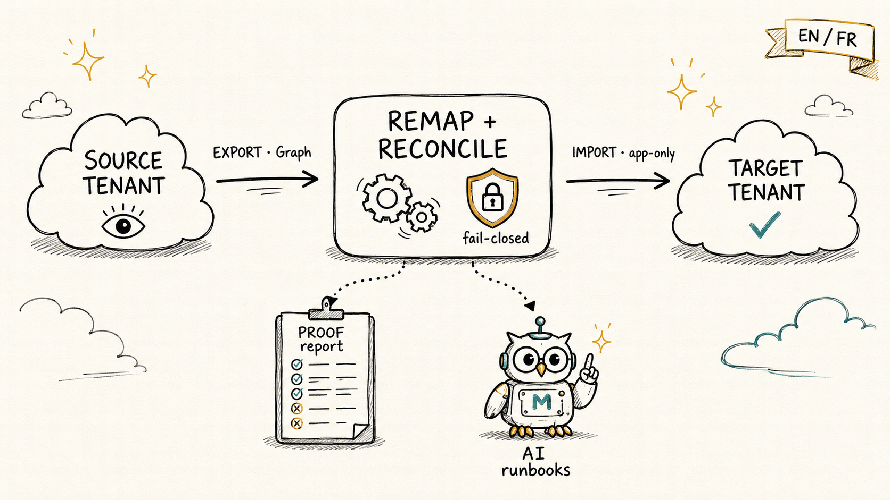
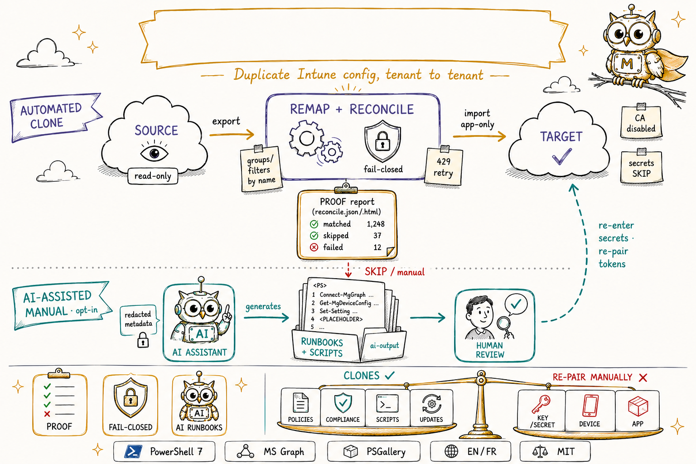

> [🇫🇷 Version française](../fr/README.md)

# intune-tenant-clone-kit

    

**Reliably clone a Microsoft Intune configuration from one tenant to another (SOURCE → TARGET).**



> **We clone the configuration; we guide the rest.** This kit **duplicates the clonable Intune
> _configuration_** from one tenant to another. It is **not** a device, identity or whole-tenant
> *migration*: managed devices re-enroll and secrets/tokens re-pair against the target — a cryptographic
> ceiling no tool can cross. Everything that cannot be cloned is **surfaced in the reconciliation report,
> never silently dropped**, and the AI assistant drafts a review-first runbook to recreate it by hand.

This kit fixes the classic pitfalls of cross-tenant Intune duplication: serialization corruption of
polymorphic payloads (Settings Catalog), atomic policy creation, missing compliance actions, script
content not returned by the export, and identifiers that are not portable between tenants.

> ⚠️ **Read [`DISCLAIMER.md`](DISCLAIMER.md) before any use.** Provided "as is", without warranty.
> Always test on a sandbox tenant first. You are responsible for its use on your tenants.

---

## At a glance


Three things set this kit apart from a raw export/import script:

- **📊 Reconciliation report** *(the differentiator)* — every run emits an object-by-object
  `reconcile.json` / `.html` / `.csv` and **fails loudly** when a security-critical object isn't applied.
- **🔒 Fail-closed by design** — unresolved exclusions/filters **block** an object instead of widening
  scope; Conditional Access is **remap-or-refuse** and always created disabled.
- **🤖 AI runbook assistant** *(opt-in)* — drafts a review-first recreation runbook for whatever no tool
  can clone; local dry-run by default, **never writes to a tenant**.

## What the kit does

Full **export → correct → import** cycle.

**Two execution modes:**
- **Manual, step by step** — [`EXECUTER.md`](EXECUTER.md): interactive sign-in, every write in PREVIEW first.
- **Unattended (hands-off import)** — [`EXECUTER_AUTO.md`](EXECUTER_AUTO.md): a single command
  (`Invoke-IntuneCloneKit-Unattended.ps1`), **app-only certificate** authentication, no prompt —
  export → cleanup → import → assignments → **reconciliation-based verification** → HTML report. Ideal
  as a scheduled task. *(Automates the configuration import without prompts; devices still re-enroll and
  secrets still re-pair by hand.)*

- **Fresh export** of the source tenant (PowerShell 7 + Microsoft Graph SDK, `beta` endpoint), **already
  rehydrated**: Settings Catalog settings, base64 content of scripts/remediations, compliance actions
  (`scheduledActionsForRule`), notification messages.
- **Corrected import**: single POST with `settings` **inline** (Settings Catalog), strict preservation
  of `[]` / single-element arrays, injection of `scheduledActionsForRule`, name-based idempotence,
  CSV log, **PREVIEW by default**.
- Optional **cleanup** of a previous failed import, **group/assignment remap by name**, anti-overwrite
  guardrail (refuses to write if the current context is not the target tenant).

## How it works



Two lanes run against **two separate tenants**: a **read-only export** from the SOURCE, then a
**corrected, PREVIEW-first import** into the TARGET — behind an anti-source-write guard that hard-fails if
the write context is not the target. A parallel **AI track** turns whatever cannot be cloned into a
review-first runbook. Every import wave emits its own reconciliation report (below).

## Reconciliation report (the differentiator)

Every import run emits, **next to the CSV log**, a machine- and human-readable reconciliation:
`reconcile.json`, `reconcile.html` and `reconcile.csv`. For **each object** it records the **outcome**
(`Matched` / `Created` / `Failed` / `Skipped` / `Preview` / `OutOfScope`), the **reason**, the
**targetId**, the **identityKey** (built on the non-prefixed source name) and any **remap** applied.

- A duplicate source `identityKey` **hard-fails** that object as `SKIP_DUP_KEY` — no silent overwrite.
- A **security-critical** family (Compliance, Conditional Access, Endpoint Security, anything named
  *baseline*) left `Failed` / `Skipped` / `OutOfScope`, or a **Conditional Access** policy created
  **disabled**, raises the red **"SECURITY-CRITICAL NOT APPLIED"** banner and returns a **non-zero exit
  code** under `-Execute` — so a scheduled run can't "succeed" while leaving a security gap.

The unattended orchestrator uses this per-wave `reconcile.json` as its **source of truth** for
verification (it no longer just compares object counts), and paginates backup/verify to avoid truncation.

## Coverage

| ✅ Automated (re-imported) | ⏸️ Manual |
|---|---|
| Settings Catalog, configuration profiles, compliance, scripts, remediations, filters, scope tags, Store apps, app config, app protection, Autopilot, notifications, groups + assignments, Windows Update (rings + Feature/Quality/Driver profiles), Terms & Conditions, Device categories, custom RBAC roles, Conditional Access (created disabled), **Admin Templates / ADMX — 🧪 experimental**, **Enrollment — 🧪 experimental** | **Not exported:** Secrets (Wi-Fi/PSK, AppLocker/WDAC, encrypted OMA), LOB/Win32/VPP apps (binaries), Device Inventory policies. **Exported but NOT re-imported:** Endpoint Security (intents). |

> 📌 Full list of what is **not** cloned (and how to handle each item): [`LIMITATIONS.md`](LIMITATIONS.md).
>
> 📊 **Full capability table** — every element, status by status (✅ automated · 🟡 partial · 🟠 manual/AI-assisted · ❌ out of reach): [`CAPABILITIES.md`](CAPABILITIES.md).
>
> 🧪 **Experimental (new in v2.3.0) — Admin Templates & Enrollment import.** These two families are now
> re-imported, but the import path is **experimental and has _not_ been validated by the maintainers against
> a live tenant.** **Run it in PREVIEW first, test on a sandbox tenant, then please
> [open a feedback issue](https://github.com/HoussemMak/intune-tenant-clone-kit/issues).** Both paths are
> **fail-closed and PREVIEW by default** — an unresolved or ambiguous case is skipped, never guessed. This is
> still **not** a "full migration": the honest positioning is unchanged.
>
> ℹ️ **Per family:**
> - **Admin Templates (`14_`, ADMX / `groupPolicyConfigurations`) — imported (experimental).** Each value's
>   definition/presentation is **remapped by attributes** across tenants; a value whose definition is
>   unresolved or ambiguous is skipped as **`SKIP_UNRESOLVED_DEF`** (fail-closed — never written blind).
> - **Enrollment (`16_`, `deviceEnrollmentConfigurations`) — imported (experimental), skip-and-flag.** Only
>   the **creatable, targeted** profiles are created (ESP, device-limit, single-platform restriction,
>   notifications). Tenant **defaults**, **priority-0** and **singletons** (Windows Hello, co-management,
>   windows-restore) are **skipped**; existing target **priorities are never reordered**; a **legacy combined
>   platform restriction** is skipped as **`SKIP_FLAG_REVIEW`** (raised as security-critical for human review).
> - **Endpoint Security intents (`15_`) — still manual (not imported).** The legacy *intents* API is
>   **frozen (~2025-03)**; **modern** Endpoint Security already imports through the **Settings Catalog family
>   (`02_`)**, so the legacy intents stay a **manual / AI-assist** step, surfaced as **`OutOfScope`**.
>
> The **reconciliation report** counts every such object (never silently dropped); an OutOfScope Endpoint
> Security object — or any object whose name contains *baseline* — additionally raises the
> **security-critical** banner (non-zero reconciliation exit code under `-Execute`).

## Security posture

- **Fail-closed, never fail-open.** An unresolved assignment **exclusion** or **filter** blocks the
  object instead of silently widening scope (switch: `-AllowPartialInclusionsOnly`). Conditional Access
  is **remap-or-refuse**: every tenant-scoped reference is remapped or the policy is refused
  (`SKIP_UNRESOLVED_CA_REF`), and CA policies are **always created disabled**.
- **App-only least privilege.** `New-IntuneCloneAppRegistration` provisions an app registration
  **without** `DeviceManagementManagedDevices.*`, mints a **non-exportable** certificate, and gates
  Conditional Access scope behind an explicit **`-EnableConditionalAccess`** opt-in.
- **Anti-source-write guard.** Writes are checked against `-SourceTenantId` vs `-TargetTenantId`
  (independent of the manifest) and **hard-fail** on a missing or corrupt manifest — the kit refuses to
  write to the source tenant.
- **Secrets are never exfiltrated.** The AI assistant runs a **local dry-run by default** (zero network
  calls); external send is a deliberate **`-SendToProvider`** opt-in, secrets are redacted and a pre-send
  secret scan **hard-fails** if anything sensitive would leave the machine. Your API key is never bundled.
- **Resilient by default.** HTTP `429 / 503 / 504` responses are retried with `Retry-After` + exponential
  backoff across export, import, assignments and the orchestrator.

## Prerequisites

- **PowerShell 7.4+** (required — not Windows PowerShell 5.1).
- The `Microsoft.Graph.Authentication` module.
- An administrator account on **each** tenant (read on the source, write on the target), with admin
  consent for the `DeviceManagement*.ReadWrite.All` scopes.

## Quick start

```powershell
# 1) Configure
Copy-Item config.example.ps1 config.ps1
#    -> edit config.ps1: fill in SourceTenantId / TargetTenantId / domains

# 2) Follow EXECUTER.md (manual) or EXECUTER_AUTO.md (unattended)
```

Details, root causes and troubleshooting: [`docs/METHODOLOGY.md`](docs/METHODOLOGY.md) · [`docs/TROUBLESHOOTING.md`](docs/TROUBLESHOOTING.md) · [`docs/SEQUENCE.md`](docs/SEQUENCE.md) (execution sequence).

## Install as a module (PowerShell Gallery)

Published on the PowerShell Gallery (see the version badge above for the current release):

```powershell
Install-Module IntuneTenantCloneKit -Scope CurrentUser
Import-Module IntuneTenantCloneKit
Get-Command -Module IntuneTenantCloneKit
```

The module wraps the **same logic** as the `scripts/` files, exposed as approved-verb cmdlets
(`Export-IntuneConfiguration`, `Import-IntuneConfiguration`, `Compare-IntuneExport`, `Test-IntuneExport`, …).
Module **exit codes are preserved** — a cmdlet returns a usable code instead of terminating the host, so
`Test-IntuneExport` / `Compare-IntuneExport` stay scriptable. Prefer the step-by-step scripts if you want
to read and trace every action. See [`../module/README.md`](../module/README.md).

## AI assist (optional, hardened, opt-in)

For the items the kit cannot auto-import (`MANUAL` / `SKIP_*` / secret-bearing objects — see
[`LIMITATIONS.md`](LIMITATIONS.md)), [`scripts/Invoke-IntuneAIAssist.ps1`](scripts/Invoke-IntuneAIAssist.ps1)
(cmdlet `Invoke-IntuneAIAssist`) drafts a recreation **runbook + `-WhatIf` PowerShell/Graph scaffolds**
(with `<PLACEHOLDER>` secrets) into `ai-output/` **for human review**. It **never writes to a tenant** and
**never auto-executes**.

- **Local dry-run by default** — with no `-SendToProvider`, it makes **zero network calls**.
- **External send is opt-in** — `-SendToProvider` is required to reach a **configurable AI endpoint**
  (Azure OpenAI preferred / OpenAI / custom); secrets are redacted and a **pre-send secret scan
  hard-fails** before anything leaves the machine.
- The **API key is yours** (set in `config.ps1`, git-ignored) and is **never shipped** with the kit.

## Advanced helpers (optional)

- **`scripts/Recover-IntuneOmaSecrets.ps1`** — pull encrypted OMA-URI secret values from the source and
  re-inject them into the export (also the orchestrator's `-RecoverSecrets`), so those profiles import
  automatically. Needs source read rights; writes plaintext to disk — protect it.
- **`scripts/Publish-IntuneApp.ps1`** *(experimental)* — orchestrate a Win32 `.intunewin` upload from a
  local binary + metadata (create app → content version → SAS → block upload → commit).
- **`scripts/Invoke-IntunePortalCaptureToScript.ps1`** — turn a portal capture (Device Inventory, gated
  endpoints) into an AI-drafted, review-first recreation script.

- **`scripts/Verify-IntuneExport.ps1`** — offline integrity check of an export (SHA-256 `checksums.json`): flags modified / missing / untracked files.
- **`scripts/Compare-IntuneExport.ps1`** — drift comparison between two exports (added / removed / changed per object, severity-ranked).

## Structure

```
en/
├── README.md
├── EXECUTER.md                         # manual mode: step -> command
├── EXECUTER_AUTO.md                    # unattended mode: a single command
├── DISCLAIMER.md
├── Invoke-IntuneCloneKit-Unattended.ps1 # unattended orchestrator (app-only certificate)
├── config.example.ps1                  # copy to config.ps1 (gitignored)
├── EN.png                              # legacy diagram (the README hero now uses ../assets/architecture.png)
├── scripts/                            # corrected import engine, exporter, cleanup, remap, assignments
├── docs/                               # methodology + troubleshooting
├── sample/                             # SYNTHETIC mini-export (expected structure)
└── tools/                              # New-IntuneCloneKitAppRegistration.ps1, check-no-secrets.ps1
```

## Security & data

This bundle **contains no real tenant data**. Real data produced at runtime (`input/`, `output/`,
`logs/`, `backup_*`, `config.ps1`) is **git-ignored**. The [`tools/check-no-secrets.ps1`](tools/check-no-secrets.ps1)
script checks for the absence of sensitive identifiers before publishing.

## License

[MIT](../LICENSE).
