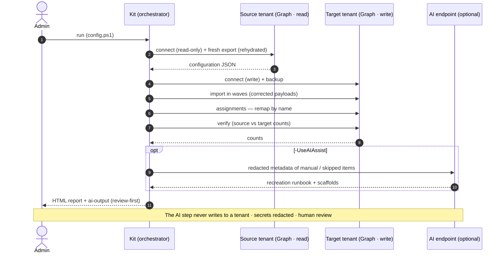

> [🇫🇷 Version française](../../fr/docs/SEQUENCE.md)

# Execution sequence

End-to-end flow of the kit, including the optional AI recreation assistant. Renders natively on GitHub.

```mermaid
sequenceDiagram
    autonumber
    actor Admin
    participant Kit as Kit (orchestrator)
    participant Src as Source tenant (Graph · read)
    participant Tgt as Target tenant (Graph · write)
    participant AI as AI endpoint (optional)

    Admin->>Kit: run (config.ps1)
    Kit->>Src: connect (read-only) + fresh export (rehydrated)
    Src-->>Kit: configuration JSON
    Kit->>Tgt: connect (write) + backup
    Kit->>Tgt: import in waves (corrected payloads)
    Kit->>Tgt: assignments — remap by name
    Kit->>Tgt: verify (source vs target counts)
    Tgt-->>Kit: counts
    opt -UseAIAssist
        Kit->>AI: redacted metadata of manual / skipped items
        AI-->>Kit: recreation runbook + scaffolds
    end
    Kit-->>Admin: HTML report + ai-output (review-first)
    Note over Admin,AI: The AI step never writes to a tenant · secrets redacted · human review
```
