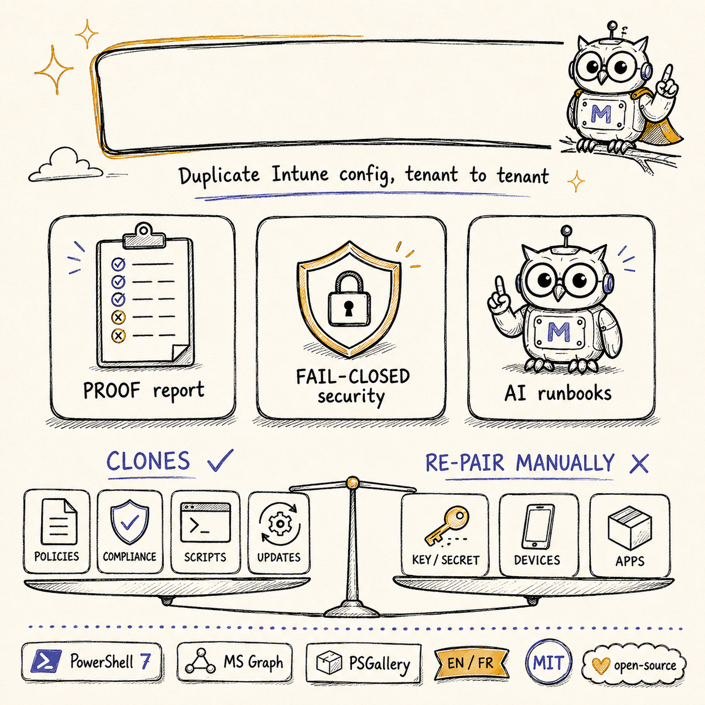

> [🇬🇧 English version](../en/LIMITATIONS.md)

# Limitations

Ce kit clone **la majorité** d'une configuration Intune, mais certains types d'objets ne peuvent pas
être exportés ou recréés automatiquement — soit à cause de contraintes de la plateforme Microsoft
Graph / Intune, soit parce qu'ils portent des données non transférables entre tenants. Traitez les
éléments ci-dessous **manuellement** dans le tenant cible.

> ### Clone, pas migration
>
> Ce kit **duplique la configuration Intune _clonable_** d'un tenant vers un autre. Ce n'est **pas** une
> *migration* d'appareils, d'identités ni de tenant complet : sur la cible, les appareils **se ré-inscrivent**
> et les secrets & tokens **se ré-appairent**. Cette frontière est un **plafond cryptographique qu'aucun outil
> ne franchit** — ce n'est pas une lacune de celui-ci. Trois catégories honnêtes :
>
> 1. **Cloné automatiquement** — ~20 familles de configuration sont exportées *et* réimportées (tableau de
>    couverture dans [`README.md`](README.md)).
> 2. **Exporté, mais recréé à la main** — Modèles d'administration (ADMX), intents Endpoint Security et
>    Enrollment sont capturés par l'export mais **pas** par le moteur d'import ; le rapport de réconciliation
>    remonte chacun en **`OutOfScope`**, donc rien n'est abandonné en silence.
> 3. **Jamais franchi — le plafond cryptographique** — secrets chiffrés (l'export ne porte jamais la valeur en
>    clair), tokens & connecteurs tiers (APNs / Apple ADE·VPP / Managed Google Play / NDES), identités
>    d'appareils & hashes matériels Autopilot, et binaires d'apps & licences store/VPP.
>
> **On clone la configuration, on guide le reste.** Pour les catégories 2 et 3, l'assistant IA opt-in
> ([`Invoke-IntuneAIAssist.ps1`](scripts/Invoke-IntuneAIAssist.ps1)) rédige un **runbook de recréation +
> des squelettes PowerShell/Graph** dans `ai-output/` pour relecture humaine — il **absorbe la corvée
> manuelle, pas le plafond cryptographique** : il n'écrit jamais dans un tenant, n'exécute jamais rien
> automatiquement, et caviarde les secrets avant tout appel réseau (opt-in).

## Non exportés / non clonés par le kit

| Type d'objet | Pourquoi | Que faire |
|---|---|---|
| **Device Inventory policies** (la nouvelle configuration *« collecte d'inventaire »* / properties catalog) | Ces politiques **ne sont pas renvoyées par les endpoints de configuration `deviceManagement` standards** énumérés par le kit, et **ne sont pas exportables avec un token Microsoft Graph classique** — le portail Intune utilise un token séparé/interne pour elles. | Recréer manuellement — ou `Invoke-IntunePortalCaptureToScript.ps1` transforme une capture portail en script de recréation rédigé par l'IA. |
| **Secrets chiffrés** (Wi-Fi/PSK, VPN, OMA-URI personnalisé avec `secretReferenceValueId`, blobs AppLocker/WDAC) | Intune n'exporte jamais une valeur secrète en clair ; le pointeur de référence est propre au tenant. | `Recover-IntuneOmaSecrets.ps1` (ou `-RecoverSecrets` de l'orchestrateur) récupère le clair depuis la source et le ré-injecte — sans re-saisie (droits de lecture source requis) ; sinon recréer et re-saisir le secret. |
| **Apps LOB / Win32 / VPP** | Le binaire d'installation (`.intunewin`, package, token VPP) ne fait pas partie des métadonnées JSON exportées. | Fournir le binaire ; `Publish-IntuneApp.ps1` (expérimental) orchestre l'upload Win32 `.intunewin`, puis remapper les affectations. |

## Exportés, mais NON réimportés automatiquement (réimport manuel)

Les familles ci-dessous **sont bien capturées par l'export**, mais **ne figurent pas dans le catalogue
d'import** (`$Catalog`) : le moteur d'import ne les recrée donc jamais — à recréer à la main dans le tenant
cible. Elles ne sont **pas** « absentes » de votre export : le **rapport de réconciliation**
(`reconcile.json` / `.html` / `.csv`) liste chacun de ces objets avec l'issue **`OutOfScope`** (comptabilisés,
jamais abandonnés en silence). Un objet **Endpoint Security** OutOfScope — ou tout objet dont le nom contient
*baseline* — lève en plus la bannière **SÉCURITÉ-CRITIQUE** et, en mode `-Execute`, force un code de sortie de
réconciliation non nul : une politique critique n'est jamais confondue avec un « tout va bien ».

| Type d'objet | Dossier d'export | Pourquoi non réimporté | Que faire |
|---|---|---|---|
| **Modèles d'administration (ADMX)** | `14_AdminTemplates` | Non gérés par le moteur d'import Settings Catalog ; absents du catalogue d'import. | Recréer au portail (ou migrer vers le Settings Catalog). |
| **Endpoint Security (intents / baselines)** | `15_EndpointSecurity` | Le modèle de templates `intents` n'est pas couvert par le moteur d'import ; absent du catalogue d'import. | Recréer au portail. Listé `OutOfScope` ; les baselines sont en plus signalées sécurité-critique. |
| **Configurations d'inscription (Enrollment)** | `16_Enrollment` | Restrictions / pages de statut d'inscription propres au tenant ; absentes du catalogue d'import. | Recréer au portail. |

> 🤖 Ces trois familles sont précisément le **gap manuel** que vise l'assistant IA opt-in : pointez
> `Invoke-IntuneAIAssist.ps1` sur l'export pour obtenir un runbook de recréation relu-avant-usage + des
> squelettes Graph dans `ai-output/`. Il absorbe la corvée (rédige les étapes et les scripts) — il n'écrit
> jamais dans votre tenant.

## Autres types de configuration non clonés

Le kit énumère un ensemble fixe d'endpoints Intune ; tout ce qui est en dehors n'est pas exporté :

- **Règles de nettoyage d'appareils**.
- **Attributions de rôles RBAC** et **définitions de rôles intégrées** (les *définitions* de rôles
  personnalisés sont clonées ; les rôles intégrés et les *attributions* — qui détient un rôle — non).
- **Personnalisation / Company branding / Organizational messages**.
- **Tokens d'inscription & connecteurs tiers** — Apple **ADE/VPP** & le certificat push **APNs**,
  **Managed Google Play** / Android Enterprise, et **connecteurs PKI / NDES / certificat** : secrets ou
  infrastructure qui **se ré-appairent** sur le tenant cible (le plafond cryptographique), non transférables.

À recréer au portail, ou à traiter avec un outil dédié.

## Hors périmètre par nature

- **Conditional Access** — exporté/importé **best-effort** : chaque politique est **créée DÉSACTIVÉE**. Ses références (utilisateurs, groupes, rôles, apps, emplacements nommés, service principals, conditions d'utilisation, authentication strength) sont **remappées vers le tenant cible** ; toute référence non résolvable fait **refuser la politique entière (fail-closed)** au lieu d'émettre un ID du tenant source. **À relire et activer manuellement.** Le scope CA est **opt-in** : l'outil d'app-registration accorde `Policy.ReadWrite.ConditionalAccess` uniquement avec **`-EnableConditionalAccess`**.
- **Appareils, utilisateurs, hashes matériels Autopilot, rapports / données d'inventaire** — données
  d'exécution, pas de la configuration (les appareils **se ré-inscrivent** sur la cible ; les hashes
  Autopilot sont re-collectés depuis le matériel lui-même).

## Gérés, mais dépendants du tenant

- **Groupes, filtres, scope tags, ID d'apps** sont **remappés par nom** — les objets cibles doivent
  déjà exister (ou être créés) au préalable ; les références non résolues sont journalisées et ignorées.
  **Les filtres d'affectation ne sont pas recréés** : une affectation filtrée dont le filtre est absent
  de la cible est **bloquée** (jamais appliquée sans son filtre), pas élargie en silence.
- **Apps Managed Google Play / VPP** doivent être approuvées et synchronisées dans le tenant cible
  avant que leurs app configurations ne s'appliquent.
- **Données d'inventaire / rapports** = télémétrie d'exécution, pas de la configuration — hors périmètre.
  Ce kit clone la **configuration**, pas les données des appareils.

## Remerciements

Merci à **Rudy Ooms** — Microsoft MVP, [call4cloud.nl](https://call4cloud.nl) — d'avoir signalé la
limitation des Device Inventory policies.
