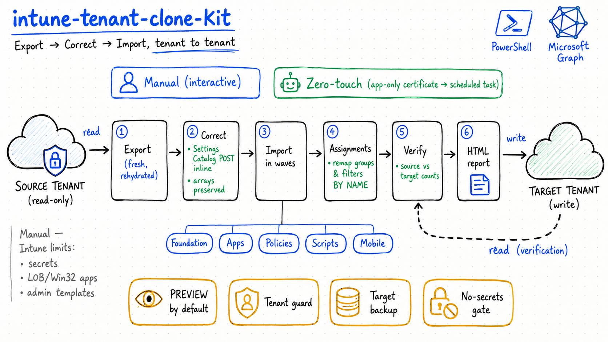

> [🇬🇧 English version](../en/README.md)

# intune-tenant-clone-kit

**Cloner la configuration Microsoft Intune d'un tenant vers un autre (SOURCE → CIBLE), de façon fiable.**



Ce kit corrige les pièges classiques de la duplication d'Intune entre tenants : corruption de la
sérialisation des payloads polymorphes (Settings Catalog), création atomique des politiques, actions
de conformité manquantes, contenu des scripts non exporté, et identifiants non portables entre tenants.

> ⚠️ **Lire [`DISCLAIMER.md`](DISCLAIMER.md) avant toute utilisation.** Fourni « en l'état », sans garantie.
> Toujours tester sur un tenant de bac à sable. Vous êtes responsable de l'usage sur vos tenants.

---

## Ce que fait le kit

Cycle complet **export → correction → import**.

**Deux modes d'exécution :**
- **Manuel, pas-à-pas** — [`EXECUTER.md`](EXECUTER.md) : connexion interactive, chaque écriture en aperçu (PREVIEW) d'abord.
- **Zéro-touch, non-surveillé** — [`EXECUTER_AUTO.md`](EXECUTER_AUTO.md) : une seule commande
  (`Invoke-IntuneCloneKit-Unattended.ps1`), authentification **app-only par certificat**, aucun prompt,
  export → nettoyage → import → affectations → vérification → rapport HTML. Idéal en tâche planifiée.

- **Export frais** du tenant source (PowerShell 7 + Microsoft Graph SDK, endpoint `beta`), **déjà
  réhydraté** : settings du Settings Catalog, contenu base64 des scripts/remédiations, actions de
  conformité (`scheduledActionsForRule`), messages de notification.
- **Import corrigé** : POST unique avec `settings` **inline** (Settings Catalog), préservation stricte
  des tableaux `[]` / mono-élément, injection de `scheduledActionsForRule`, idempotence par nom,
  journal CSV, **aperçu (PREVIEW) par défaut**.
- **Nettoyage** optionnel d'un import précédent raté, **remap des groupes/affectations par nom**,
  garde-fou anti-écrasement (refuse d'écrire si le contexte n'est pas le tenant cible).

## Couverture

| ✅ Automatisé | ⏸️ Manuel (limites Intune) |
|---|---|
| Settings Catalog, Profils de configuration, Conformité, Scripts, Remédiations, Filtres, Scope tags, Apps Store, App Config, App Protection, Autopilot, Notifications, Groupes + affectations, Windows Update (anneaux + profils Feature/Quality/Driver), Termes & conditions, Catégories d'appareils, rôles RBAC personnalisés | Secrets (Wi-Fi/PSK, AppLocker/WDAC, OMA chiffré), Apps LOB/Win32/VPP (binaires), Admin Templates, Endpoint Security (intents), Enrollment, **Device Inventory policies** |

> 📌 Liste complète de ce qui n'est **pas** cloné (et comment gérer chaque élément) : [`LIMITATIONS.md`](LIMITATIONS.md).

## Prérequis

- **PowerShell 7.4+** (obligatoire — pas Windows PowerShell 5.1).
- Module `Microsoft.Graph.Authentication`.
- Un compte administrateur sur **chaque** tenant (lecture sur la source, écriture sur la cible),
  avec consentement admin des scopes `DeviceManagement*.ReadWrite.All`.

## Démarrage rapide

```powershell
# 1) Configurer
Copy-Item config.example.ps1 config.ps1
#    -> éditer config.ps1 : renseigner SourceTenantId / TargetTenantId / domaines

# 2) Suivre EXECUTER.md (manuel) ou EXECUTER_AUTO.md (zéro-touch)
```

Détails, causes racines et dépannage : [`docs/METHODOLOGY.md`](docs/METHODOLOGY.md) · [`docs/TROUBLESHOOTING.md`](docs/TROUBLESHOOTING.md) · [`docs/SEQUENCE.md`](docs/SEQUENCE.md) (séquence d'exécution).

## Assistant IA (optionnel, expérimental)

Pour les éléments non importables automatiquement (voir [`LIMITATIONS.md`](LIMITATIONS.md)),
[`scripts/Invoke-IntuneAIAssist.ps1`](scripts/Invoke-IntuneAIAssist.ps1) peut demander à un **endpoint
IA configurable** (Azure OpenAI / OpenAI / personnalisé) de rédiger un **runbook de recréation + des
scaffolds PowerShell** pour revue humaine. Il **n'écrit jamais dans un tenant**, expurge les secrets
avant l'envoi, et est **opt-in** — la clé API est la vôtre (dans `config.ps1`, gitignoré) et n'est
jamais livrée avec le kit.

## Structure

```
fr/
├── README.md
├── EXECUTER.md                         # mode manuel : étape → commande
├── EXECUTER_AUTO.md                    # mode zéro-touch : une seule commande
├── DISCLAIMER.md
├── Invoke-IntuneCloneKit-Unattended.ps1 # orchestrateur non-surveillé (app-only certificat)
├── config.example.ps1                  # à copier en config.ps1 (gitignoré)
├── FR.png                              # schéma d'architecture
├── scripts/                            # moteur d'import corrigé, exporteur, cleanup, remap, affectations
├── docs/                               # méthodologie + dépannage
├── sample/                             # mini-export SYNTHÉTIQUE (structure attendue)
└── tools/                              # New-IntuneCloneKitAppRegistration.ps1, check-no-secrets.ps1
```

## Sécurité & données

Ce bundle **ne contient aucune donnée réelle de tenant**. Les vraies données générées à l'exécution
(`input/`, `output/`, `logs/`, `backup_*`, `config.ps1`) sont **ignorées par git**. Le script
[`tools/check-no-secrets.ps1`](tools/check-no-secrets.ps1) vérifie l'absence d'identifiants sensibles.

## Licence

[MIT](../LICENSE).
