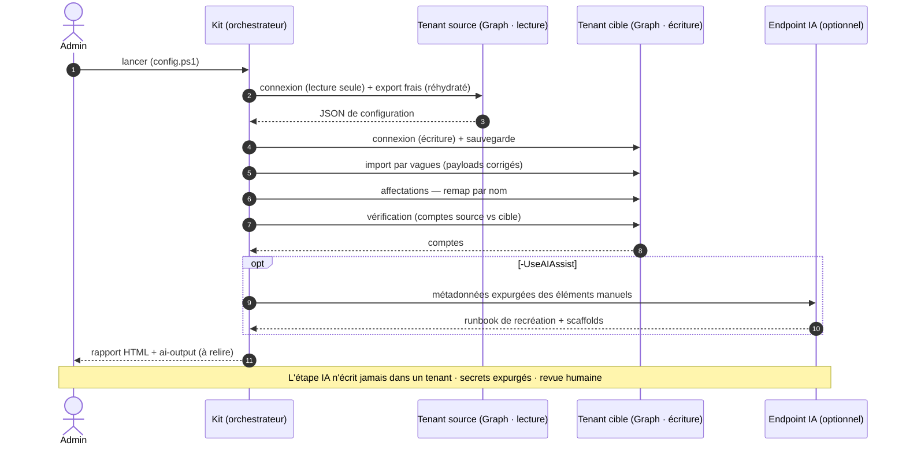

> [🇬🇧 English version](../../en/docs/SEQUENCE.md)

# Séquence d'exécution

Flux de bout en bout du kit, incluant l'assistant IA de recréation optionnel. S'affiche nativement sur GitHub.

```mermaid
sequenceDiagram
    autonumber
    actor Admin
    participant Kit as Kit (orchestrateur)
    participant Src as Tenant source (Graph · lecture)
    participant Tgt as Tenant cible (Graph · écriture)
    participant AI as Endpoint IA (optionnel)

    Admin->>Kit: lancer (config.ps1)
    Kit->>Src: connexion (lecture seule) + export frais (réhydraté)
    Src-->>Kit: JSON de configuration
    Kit->>Tgt: connexion (écriture) + sauvegarde
    Kit->>Tgt: import par vagues (payloads corrigés)
    Kit->>Tgt: affectations — remap par nom
    Kit->>Tgt: vérification (comptes source vs cible)
    Tgt-->>Kit: comptes
    opt -UseAIAssist
        Kit->>AI: métadonnées expurgées des éléments manuels
        AI-->>Kit: runbook de recréation + scaffolds
    end
    Kit-->>Admin: rapport HTML + ai-output (à relire)
    Note over Admin,AI: L'étape IA n'écrit jamais dans un tenant · secrets expurgés · revue humaine
```
